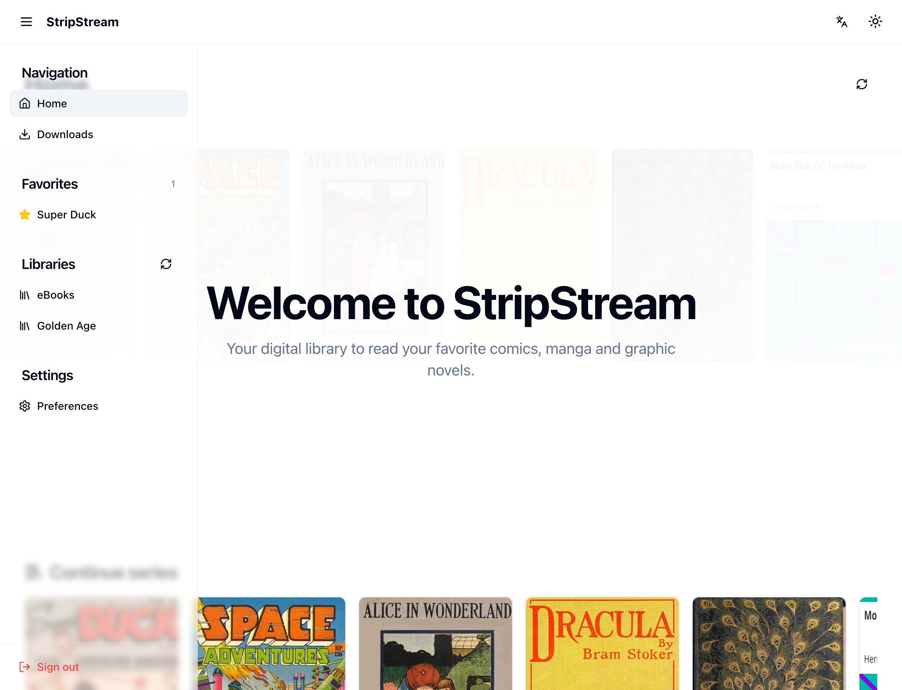

# Stripstream

A modern web application for reading digital comics, built with Next.js 14 and the Komga API.

You can try it out with the following credentials on https://stripstream.julienfroidefond.com :

- Email: `demo@stripstream.local`
- Password: `fft$VSD96dis`

The demo site is hosted on a small server, so it may be occasionally unavailable.

Although this application was designed to handle multiple users with their own Komga configuration, it is recommended to install it on your server and configure the Komga URL to localhost for better performance and stability.

## 📸 Capture

### Home




### Series


### Books


### Reader


## 🚀 Technologies

- [Next.js 14](https://nextjs.org/)
- [React 18](https://reactjs.org/)
- [TypeScript](https://www.typescriptlang.org/)
- [Tailwind CSS](https://tailwindcss.com/)
- [Shadcn/ui](https://ui.shadcn.com/)
- [Docker](https://www.docker.com/)

## 📦 Major features

- Synchronize with Komga : read progress, series list, books list
- Reader
  - Right to left
  - Page view : double page, single page
  - Page navigation : page number, page percentage, page scroll
  - Page zoom : fit to width, fit to height, fit to page
  - Auto double page on ipad if horizontal
  - Fullscreen button for desktop and ipad safari
  - Thumbnail view : carousel of pages
  - Handling touch and key events
- Language : english / french
- Favorites : local only, not synchronized with Komga
- UI
  - Dark / light mode
  - Responsive design
  - Loading state
  - Error states
  - progress bars on series and books
- books list
  - Pagination
  - Mark as read / mark as unread buttons
  - Download button
- Series list
  - Pagination
  - search
- Server caching for all ressources and TTL in settings
- PWA
  - Download locally in storage books
  - Offline mode
- Settings to configure the application
  - Komga configuration
  - Cache and TTLs
  - Default filter
  - Thumbnail with first page high quality or thumbnails
  - Debug mode (show Komga API / next / mongo requests and responses timings)

## 🛠 Prerequisites

- Node.js 20.x or higher
- Yarn 1.22.x or higher
- Docker and Docker Compose (optional)

## 📦 Installation

### Standard Method

1. Clone the repository

```bash
git clone [repo-url]
cd stripstream
```

2. Install dependencies

```bash
yarn install
```

3. Copy the example environment file and adjust it to your needs

```bash
cp .env.example .env.local
```

4. Start the development server

```bash
yarn dev
```

### With Docker

1. Clone the repository and navigate to the folder

```bash
git clone [repo-url]
cd stripstream
```

2. Launch with Docker Compose

```bash
docker-compose up --build
```

The application will be accessible at `http://localhost:3000`

## 🔧 Available Scripts

- `yarn dev` - Starts the development server
- `yarn build` - Creates a production build
- `yarn start` - Runs the production version
- `yarn lint` - Checks code with ESLint
- `yarn format` - Formats code with Prettier

## 🌐 Komga API

The application uses the Komga API for comic book management. The API documentation is available here:
[Komga API Documentation](https://cloud.julienfroidefond.com/swagger-ui/index.html#/)

## 🏗 Project Structure

```
src/
├── app/                 # Next.js pages and routes
├── components/          # Reusable React components
├── constants/          # Application constants
├── contexts/           # React contexts
├── hooks/              # Custom React hooks
├── i18n/               # Internationalization configuration
├── lib/                # Utilities and services
├── messages/           # Translation messages
├── middleware.ts       # Next.js middleware
├── styles/             # Global styles
├── types/              # TypeScript type definitions
└── utils/              # Helper functions and utilities

docs/                   # Project documentation
scripts/                # Utility scripts
public/                 # Static assets
```

## 🤝 Contributing

1. Create a branch for your feature
2. Commit your changes
3. Push to the branch
4. Open a Pull Request

## 📝 Development Guidelines

- Follow DRY (Don't Repeat Yourself) principles
- Use TypeScript for all new code
- Use Tailwind classes for styling
- Implement accessibility features
- Update devbook.md for any significant changes
- Follow the project's code style (enforced by ESLint and Prettier)

## 📄 License

This project is licensed under the MIT License.

```text
MIT License

Copyright (c) 2025 Julien Froidefond

Permission is hereby granted, free of charge, to any person obtaining a copy
of this software and associated documentation files (the "Software"), to deal
in the Software without restriction, including without limitation the rights
to use, copy, modify, merge, publish, distribute, sublicense, and/or sell
copies of the Software, and to permit persons to whom the Software is
furnished to do so, subject to the following conditions:

The above copyright notice and this permission notice shall be included in all
copies or substantial portions of the Software.

THE SOFTWARE IS PROVIDED "AS IS", WITHOUT WARRANTY OF ANY KIND, EXPRESS OR
IMPLIED, INCLUDING BUT NOT LIMITED TO THE WARRANTIES OF MERCHANTABILITY,
FITNESS FOR A PARTICULAR PURPOSE AND NONINFRINGEMENT. IN NO EVENT SHALL THE
AUTHORS OR COPYRIGHT HOLDERS BE LIABLE FOR ANY CLAIM, DAMAGES OR OTHER
LIABILITY, WHETHER IN AN ACTION OF CONTRACT, TORT OR OTHERWISE, ARISING FROM,
OUT OF OR IN CONNECTION WITH THE SOFTWARE OR THE USE OR OTHER DEALINGS IN THE
SOFTWARE.
```
