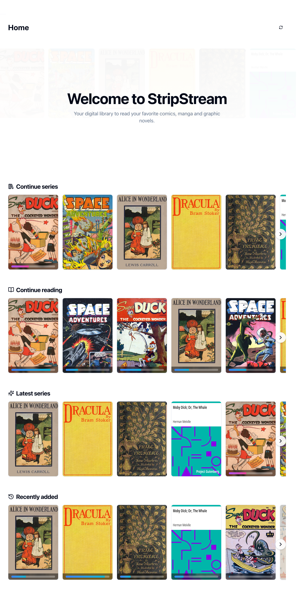
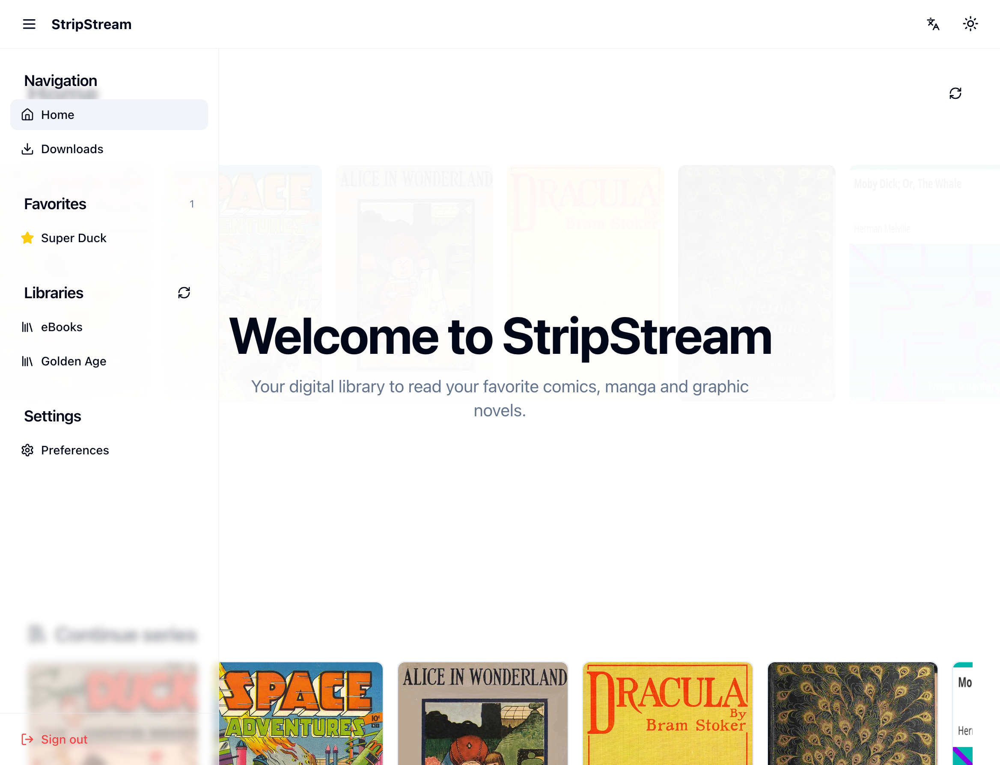

# Stripstream

A modern web application for reading digital comics, built with Next.js 16, React 19, Tailwind CSS and a multi-provider backend (Komga and Stripstream).

## 📸 Capture

### Home





### Series


### Books


### Reader


## 🚀 Technologies

- [Next.js](https://nextjs.org/) 16 (App Router, React Server Components)
- [React](https://reactjs.org/) 19
- [TypeScript](https://www.typescriptlang.org/)
- [Tailwind CSS](https://tailwindcss.com/)
- [Shadcn/ui](https://ui.shadcn.com/)
- [Prisma](https://www.prisma.io/) with SQLite
- [Docker](https://www.docker.com/)

## 📦 Major features

- Multi-provider library access, configured per user: Komga and Stripstream
- Synchronize with Komga : read progress, series list, books list
- Reader
  - Right to left
  - Page view : double page, single page
  - Page navigation : page number, page percentage, page scroll
  - Page zoom : fit to width, fit to height, fit to page
  - Auto double page on ipad if horizontal
  - Fullscreen button for desktop and ipad safari
  - Thumbnail view : carousel of pages
  - Handling touch and key events
- Language : english / french
- Favorites : saved server-side in SQLite per user, provider config and series (not synced to Komga)
- UI
  - Dark / light mode
  - Responsive design
  - Loading state
  - Error states
  - progress bars on series and books
- books list
  - Pagination
  - Mark as read / mark as unread buttons
- Series list
  - Pagination
  - search
- Server-side caching for all resources, with per-resource TTLs
- PWA
  - Installable app shell (web manifest and install prompt)
- Settings to configure the application
  - Provider connections (Komga / Stripstream)
  - Default filter
  - Thumbnail with first page high quality or thumbnails
  - Reader preferences (prefetch count, and more)

## 🛠 Prerequisites

- Node.js 20.x or higher
- pnpm 9.x or higher
- Docker and Docker Compose (optional)

## 📦 Installation

### Standard Method

1. Clone the repository

```bash
git clone [repo-url]
cd stripstream
```

2. Install dependencies

```bash
pnpm install
```

3. Copy the example environment file and adjust it to your needs

```bash
cp .env.example .env
```

The example documents the required `DATABASE_URL` (SQLite), the NextAuth values
(`NEXTAUTH_SECRET`, `NEXTAUTH_URL`) and the optional debug flags
(`CACHE_DEBUG`, `KOMGA_DEBUG`, `STRIPSTREAM_DEBUG`). See `ENV.md` for the full
reference.

4. Regenerate the Prisma client

`pnpm install` runs `prisma generate` from its postinstall hook before `.env`
exists, so the generated client is not pointed at `DATABASE_URL`. Regenerate it
now that the file is in place:

```bash
pnpm prisma generate
```

5. Apply the database migrations

The schema is not created by the seed script. On a fresh database, apply the
migrations first:

```bash
pnpm prisma migrate deploy
```

Use `pnpm prisma migrate dev --name <name>` while developing to create a new
migration and apply it.

6. Seed the admin user

```bash
pnpm init-db
```

7. Start the development server

```bash
pnpm dev
```

### With Docker (Build Local)

1. Clone the repository and navigate to the folder

```bash
git clone [repo-url]
cd stripstream
```

2. Launch with Docker Compose

```bash
docker-compose up --build
```

The application will be accessible at `http://localhost:3020`

### With Docker (DockerHub Image)

You can also use the pre-built image from DockerHub without cloning the repository:

1. Create a `docker-compose.yml` file:

```yaml
services:
  app:
    image: julienfroidefond32/stripstream:latest
    ports:
      - "3000:3000"
    environment:
      # Required
      - NEXTAUTH_SECRET=your_secret_here        # openssl rand -base64 32
      - NEXTAUTH_URL=http://localhost:3000

      # Optional — defaults shown
      # - NODE_ENV=production
      # - DATABASE_URL=file:/app/prisma/data/stripstream.db
      # - ADMIN_DEFAULT_PASSWORD=Admin@2025
      # - AUTH_TRUST_HOST=true
      # - KOMGA_MAX_CONCURRENT_REQUESTS=5
    volumes:
      - ./data:/app/prisma/data
    restart: unless-stopped
```

2. Run the container:

```bash
docker-compose up -d
```

The application will be accessible at `http://localhost:3000`

## 🔧 Available Scripts

- `pnpm dev` - Starts the development server
- `pnpm build` - Creates a production build
- `pnpm start` - Runs the production server
- `pnpm start:prod` - Seeds the admin user, then runs the production server (apply migrations first)
- `pnpm init-db` - Seeds the admin user (run after applying migrations)
- `pnpm reset-admin-password` - Resets the admin credentials
- `pnpm lint` - Checks code with ESLint (must pass with 0 warnings)
- `pnpm typecheck` - Runs the TypeScript compiler (`tsc --noEmit`)
- `pnpm knip` - Detects unused files, dependencies and exports
- `pnpm test:e2e` - Builds the E2E bundle, then runs the Playwright suite
- `pnpm test:e2e:run` - Runs Playwright against an existing build
- `pnpm test:e2e:build` - Builds the app for E2E into `.next-e2e`
- `pnpm test:e2e:read-only` - Runs the read-only Playwright project
- `pnpm test:e2e:mutating` - Runs the mutating Playwright project
- `pnpm test:e2e:ui` - Opens the interactive Playwright UI
- `pnpm test:e2e:report` - Shows the last Playwright report
- `pnpm test:e2e:timings` - Prints the E2E timing report
- `pnpm icons` - Generates the PWA icons and splash screens
- `pnpm postinstall` - Generates the Prisma client (runs automatically)
- `pnpm prepare` - Installs the Husky git hooks (runs automatically)

### Database Migrations

The schema lives in `prisma/schema.prisma`. Create and apply a migration with:

```bash
pnpm prisma migrate dev --name <name>
```

Prisma reads `DATABASE_URL` (and the other variables it needs) from `.env`.
It does not read the local env file used by Next.js development, so keep these
values in `.env`.

### Docker Push Script

The `docker-push.sh` script automates building and pushing the Docker image to DockerHub:

```bash
# Push with 'latest' tag
./docker-push.sh

# Push with a specific version tag
./docker-push.sh v1.0.0
```

**Prerequisite:** You must be logged in to DockerHub (`docker login`) before running the script.

## 🌐 Komga API

Stripstream talks to either Komga or the Stripstream Librarian backend, and this
section documents the Komga provider only. The Komga API reference is available
here:
[Komga API Documentation](https://cloud.julienfroidefond.com/swagger-ui/index.html#/)

## 🏗 Project Structure

```
src/
├── app/                 # Next.js pages, route handlers and server actions
├── components/          # Reusable React components
├── constants/           # Application constants
├── contexts/            # React contexts
├── hooks/               # Custom React hooks
├── i18n/                # Internationalization configuration
│   └── messages/        # Translation dictionaries (en, fr)
├── lib/                 # Utilities, services and media providers
├── proxy.ts             # Next.js proxy (ex-middleware)
├── styles/              # Global styles
├── types/               # TypeScript type definitions
└── utils/               # Helper functions and utilities

docs/                   # Project documentation
scripts/                # Utility scripts
public/                 # Static assets
```

## 🤝 Contributing

1. Create a branch for your feature
2. Commit your changes
3. Push to the branch
4. Open a Pull Request

## 📝 Development Guidelines

- Follow DRY (Don't Repeat Yourself) principles
- Use TypeScript for all new code
- Use Tailwind classes for styling
- Implement accessibility features
- Run `pnpm lint` (0 warnings) and `pnpm typecheck` before opening a Pull Request
- For significant changes, update the relevant documentation: `AGENTS.md` for repository and agent conventions, and `docs/architecture.md` for the system reference
- Follow the project's code style (enforced by ESLint and Prettier)

## 📄 License

This project is licensed under the MIT License.

```text
MIT License

Copyright (c) 2025 Julien Froidefond

Permission is hereby granted, free of charge, to any person obtaining a copy
of this software and associated documentation files (the "Software"), to deal
in the Software without restriction, including without limitation the rights
to use, copy, modify, merge, publish, distribute, sublicense, and/or sell
copies of the Software, and to permit persons to whom the Software is
furnished to do so, subject to the following conditions:

The above copyright notice and this permission notice shall be included in all
copies or substantial portions of the Software.

THE SOFTWARE IS PROVIDED "AS IS", WITHOUT WARRANTY OF ANY KIND, EXPRESS OR
IMPLIED, INCLUDING BUT NOT LIMITED TO THE WARRANTIES OF MERCHANTABILITY,
FITNESS FOR A PARTICULAR PURPOSE AND NONINFRINGEMENT. IN NO EVENT SHALL THE
AUTHORS OR COPYRIGHT HOLDERS BE LIABLE FOR ANY CLAIM, DAMAGES OR OTHER
LIABILITY, WHETHER IN AN ACTION OF CONTRACT, TORT OR OTHERWISE, ARISING FROM,
OUT OF OR IN CONNECTION WITH THE SOFTWARE OR THE USE OR OTHER DEALINGS IN THE
SOFTWARE.
```
